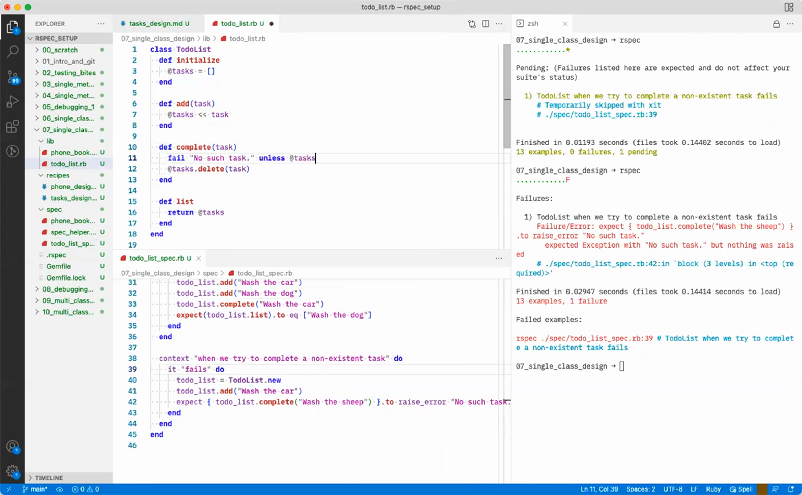

Let's talk a bit about ambition.

Earlier today I was doing one of my weekly routines — a walk to the bakery to
get lunch. When I do this I listen to podcasts and audiobooks and such. At the
moment I'm on a bit of a jcarmack kick. First Masters Of Doom, now the recent
Lex interview with him.

My mind was in and out today, because I was also having all kinds of ideas for
projects. I think actually completing my last one has been very stimulating. I
say 'actually' because my projects usually don't get finished. They're typically
too big, too sprawling, too ambitious — and as a result I get tired and
discouraged not getting anything actually done. Then I give up.

But this time I completed something. Why?

Firstly, I have cut down my job hours a lot (to 9-6). This has given me a lot
more energy to spend on these things.

Secondly, I set out some rules to combat the workaholic behaviours I've picked
up in the past few years. Keeping it separated from work was quite key — it
stopped me hyping things up too much and generating in my mind the idea of
unmanageable expectations.

Finally, I scoped it small. I've been noticing for a while that people who
create great things typically don't just walk off one day and build their grand
vision. These projects often come after a great many smaller projects, studies,
investigative works.

Which, when you think about it, is pretty obvious. Often this is due to an
everyday forcing function — say, needing to build something to sell pretty
quick. That was how the jcarmack/id software story goes at the beginning.

(There's that speed = quality idea coming up again...)

But it is annoying! Because I'm impatient to get to the really exciting vision!
And deep down I sort of do believe I don't really need to build my skills before
I can execute on it.

But I do. A nice middle ground is building an intermediate but connected step
towards it. It doesn't need to be trivially achievable but it probably should
have only one or two genuine mysteries.

So. Onwards.

---

-----BEGIN PGP MESSAGE-----

hF4Dh5pIWT1VbfcSAQdABPp1VAAbEeIGEBg6DpCyTB2O7/M1acUxzFTwoMu5rWkw
3UTBz8Cq+wsTJLAvOOrJYBDVzNuJiHohAblCtsvHTRVmZV6UHZ1xMDHRZh/wyYQd
1OoBCQIQzFJqEG4PkHPbpbGJ2y6unDxXfqtKJdWpVMp2roNNUk6zi72YJMVGufpD
gxSFSmj6tI5s1sQB7NYtmT350UQO5dvtvnnaTtwsizFrW5dm7Bxd7eECagDJkN9l
U/p/nIZZcAp2K3UDBy9KF0yazDf9jZnqGcrXogfnFd/BIQyCYorcNvVCx+DW6/9P
GgRgVPHpnCqFOa03eozDmURfFLFrPOAh040APmjafh7bSzqw9C57a4v0qmPRgFwZ
3eHf6s34LSvz31oK+Rft70wuc/JZ6zsD5CiqXBQErWr/QzZa7hizCm4dQc/H0MDr
ZjnzzHAH+bV4nzaAymwz67jnDwlp4Ykncn53vJytrKJ9Hdhw40X1uyoXSIF69TAf
m2s5NxO9EA09NA7lcJdqwRQO4N25mlwy/yrOELSgPJkAlhvirJ/jbRlFCOeQxDEM
64DuTNxITk76ASYvwcMHivQH3PhN0M1o7j6cWf7CR1FYQgtvhe3YHOxsWR4pLV5V
A3vwftRPgtfbWTZ75xV5i7vQ+0T56iltnY92v8kyeip0BwJ6ZKp/zKkP37ZFWqbp
mMlIVpwu9o9hcYlk/Uib410IOgY74mlrLzNL2OdHaOzTmTySnPbbCMA+nCC7gg+d
R/APmu9sYAv8JiCK2tACR+ea7oBJXrzsKgcEpUELkdfByy41c93AsYo/FigSmGXO
MBc/34CWWiF+77iE9z6e1HfBsNzl7lgsv29xg6KO6ERUfQ1dpabzr9xjTOfZP/Z+
G0k2Vy8xtI91mnH6A59XAnONYb5Xy59eqLU4glCmHEJHfO9V6K0eGZTki825Kk9C
jj2jSkM6TLE4RrZcrGZouf5j8iCUw6Dy433VIHpp0wefRj0lX/lZK0kZPwCdUl63
cW8VFANBRzJxGocZKX1ILUuowmgHKixdtHdFeOBTV3fVAmTM/hlDW9PcjvyKuDCY
4j0jBuiLcl8kVJDz7Wn9V6bNe4DYYHS9SyGkP+cO/kPRlonUb54DLW+FASMATawc
JLdUTzIGuak/0+NKuKbeIM9W5M1GpbiU/SRpAME6EbwYde5md6XeGxS6ApK8TuYg
p/OTrNzKtlbGw7TUpLAVHDSjJlZL9W6qGIJJDHlig/qvmloNAEDrozy6ojz5pR1I
sAgaF8alMqq3uE4sdSJAWqao2pBAWpnq9Ynfiw4gZYBVsr4i3vuxh0SCy0Djc1wg
ZjO/qP62whr2+o0Bo1OLHkBS/HZAiXj9Pm8CvsADAARkYsq21KqlcCKzEo9+HMhr
3I/VKLL26Cji7QkFex8EWAzZxGaVbLRceesYvt8tGol2ZaO7Ca0tZQD8kIDCwZjg
OZfndAYN7QGCuYmGMIhM15jGA1jCIQ==
=7B5S

-----END PGP MESSAGE-----


---

But before that we sort of need to work out what to do about confidentiality in
these files...

OK — I've set up encryption in my local editor. Probably the easiest way for
now.

---

So here's an interesting idea for the previous video project: pumping the OCR'd
frame into a large language model (LLM). Take a look at this exchange.

First, the original screenshot:



Next, the OCR into a prompt.

> Below is some OCR of a screenshot of a learner writing some code, tests, and using the terminal.
> 
> ```
> eoe todo_list.rb — rspec_setup 08\nIi\"fi EXPLORER ¥ tasks_design.md U @ todo_listrb U @ tm - zsh 8 -\nv RSPEC_SETUP 07_single_class_design > lib > @ todo_list.rb 07_single_class_design » rspec\n> 00_scratch B 1 class TodoList R ateta i ata s Ha A,\n> 01_intro_and_git 2 def initialize\n> 02_testing_bites ® 3 @tasks = [] Per_mxrlag. (Failures listed here are expected and do not affect your\n= suite's status)\n> 03_single_met... ® 4 end\n> 04_single_met... * 5 L 1) TodoList when we try to complete a non-existent task fails\n> 05_debugging_1 * 6 def add(task) # Temporarily skipped with xit\n> 06_single_clas... 7 @tasks << task # ./spec/todo_list_spec.rb:39\nv 07_single_clas.. * : end\nv lib * 10 def complete(task) Finished in 0.01193 seconds (files took 0.14402 seconds to load)\n@ phone_book.... U 13 examples, © failures, 1 pendin\ne T 1 fail \"No such task.” unless @tasky — .\ns 12 @tasks.delete(task) 07_single_class_design - rspec\no o 13 end R\n¥ phone_desig... U 14\n¥ tasks_design.. U 15 def list Failures:\nv spec B\n@ phona. L v 18 xetinnetasks 1) TodoList when we try to complete a non-existent task fails\n= 17 end Failure/Exrror: expect { todo_list.complete(“Wash the sheep”) }\n@ spec_helper.... U 18 end .to raise_error “No such task.*\n@ todo_list_sp... U 19 expected Exception with “No such task.\" but nothing was rais\nSl e todo_list. b | od\nGemfile u L i # ./spec/todo_list_spec.rb:42:in 'block (3 levels) in <top (re\n- 07_single_class_design > spec > @ todo_list_spec.rb quired)>'\nG‘\"‘M\"b_d‘ et 31 todo_list.add(“Wash the car\")\n> 08_debugging... * 32 todo_list.add(\"Wash the dog\") Finished in 0.02947 seconds (files took 0.14414 seconds to load)\n> 09_multi_class... * 33 todo_list.complete(\"Wash the car\") 13 examples, 1 failure\n> 10_multi_class... * \" \"\n34 expect(todo_list.list).to eq [\"Wash the dog\"] Failed examples:\n35 end\n36 end rspec ./spec/todo_list_spec.rb:39 # TodoList when we try to complet\n37 e a non-existent task fails\n38 context “\"when we try to complete a non-existent task\" do\n39 it \"fails\" do 07_single_class_design - []\n40 todo_list = TodoList.new\n41 todo_list.add(\"Wash the car\")\na2 expect { todo_list.complete(“Wash the sheep\") }.to raise_error \"No such taskT\na3 end\na4 end\n45  end\na6\n> TIMELINE\nmain® 0AC 1 9 Spaces:2 UTF-8 LF Ruby s Spe! »\n
> ```
> 
> Is the test suite shown as passing or failing in this screenshot? If so, recover the test output.
>
> ---
>
> The test suite is shown as failing in this screenshot. The test output is:
>
> ```
> Finished in 0.01193 seconds (files took 0.14402 seconds to load)
> 13 examples, 1 failure
> Failed examples:
> rspec ./spec/todo_list_spec.rb:39 # TodoList when we try to complete a non-existent task fails
> ```
>
> ---
>
> What error is displayed?
>
> ---
>
> The error displayed is:
>
> ```
> Failure/Error: expect { todo_list.complete(“Wash the sheep”) }.to raise_error “No such task.*
> expected Exception with “No such task.” but nothing was raised
> # ./spec/todo_list_spec.rb:42:in 'block (3 levels) in <top (required)>'
> ```

If I instead ask it:

> Display the code and the tests exactly as they appear in the screenshot.

It responds:

> ```
> class TodoList
>   def initialize
>     @tasks = []
>   end
>   
>   def add(task) # Temporarily skipped with xit
>     @tasks << task
>   end
> 
>   def complete(task)
>     raise "No such task." unless @tasks.include?(task)
>     @tasks.delete(task)
>   end
>   
>   def list
>     @tasks
>   end
> end
> 
> describe "TodoList" do
>   it "when we try to complete a non-existent task fails" do
>     todo_list = TodoList.new
>     todo_list.add("Wash the car")
>     todo_list.add("Wash the dog")
>     todo_list.complete("Wash the car")
>     expect(todo_list.list).to eq ["Wash the dog"]
> 
>     context "when we try to complete a non-existent task" do
>       it "fails" do
>         todo_list = TodoList.new
>         todo_list.add("Wash the car")
>         expect { todo_list.complete("Wash the sheep") }.to raise_error "No such task."
>       end
>     end
>   end
> end
> ```

Not perfect, but pretty damn good. Better segmentation and OCR, plus some prompt
engineering, might get us results we could use for a great many purposes. I'm
thinking there may be something in this!

Idea came from a post on Mastodon that linked to [this gist about summarising
youtube
videos.](https://gist.github.com/simonw/9932c6f10e241cfa6b19a4e08b283ca9)
